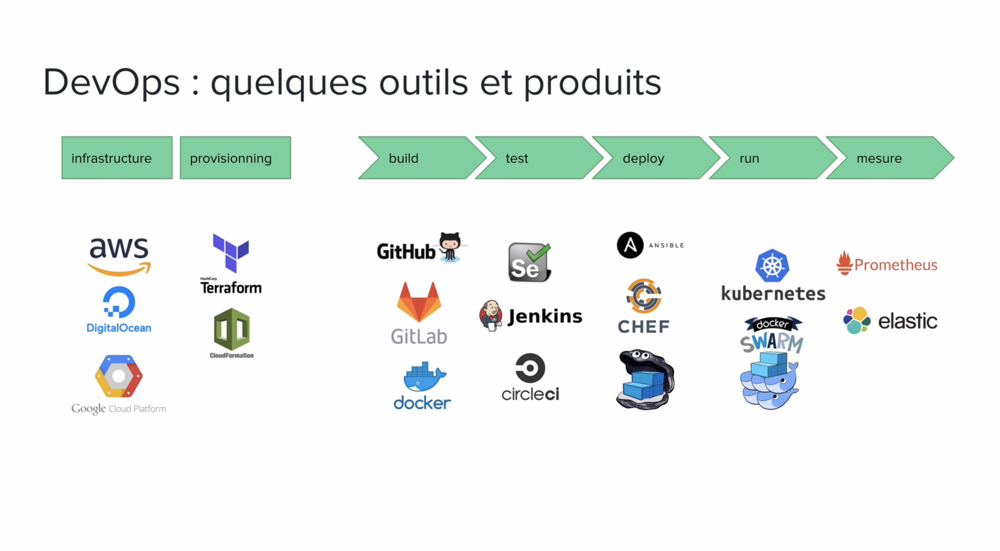
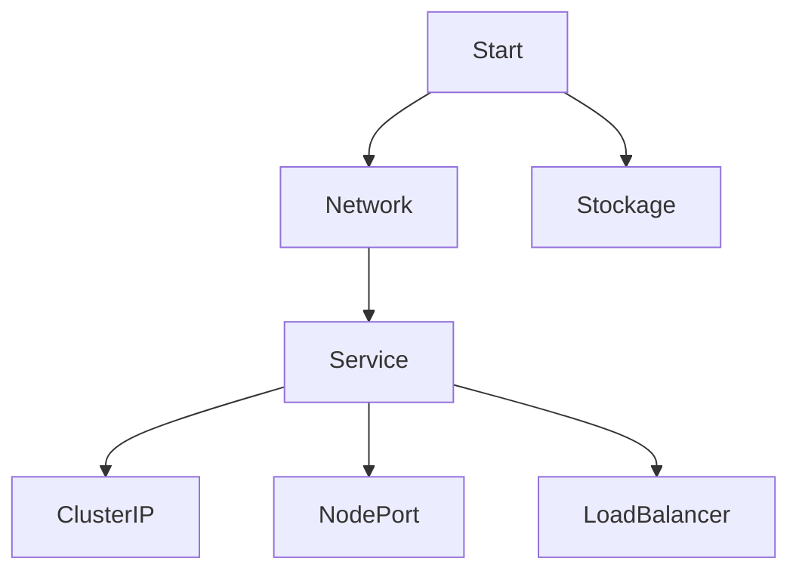

# Kubernetes | K8S | kube

> --From the Greek word pilot or helmsman.
> 
> Kubernetes is an open-source, extensible, portable platform that automates 
> software management, deployment, and scaling of containerized services and 
> workloads.

- https://youtu.be/10DBlZJntHc?t=752
- https://www.udemy.com/course/la_plateforme_k8s/learn/lecture/9922946?start=0#overview

## Concepts

Containers
- It is an isolated processus (namespace & control groups)

Docker
- [Docker](../docker)
- Facilitates usage of containers
- Brings the concept of `image`:
  - package of an application and its dependencies (dependencies from Hell)
  - instantiate in a container
  - deployed on many environments
  - Lot of images on the Docker Hub: https://hub.docker.com

Microservices architecture
- Cut applications into many services (performance)
- Independent process with its own business responsibility
- Its own language
- Dedicated team per service
- A service can be updated alone
- Facilitate bug detection
- Extract the complexity of orchestration from the app 
- CONS: interfaces should be well-defined
- CONS: must have integration tests

Cloud Native
- Microservices oriented
- Packaged as containers
- Dynamically orchestrated
- CNCF.io | Cloud Native Computing Foundation (K8S, Prometheus, Fluentd...)

DevOps
- Reduce time between a feature is developed, and it is in production
- Continuous Deployment
- Automated Tests
- Automated Processes: provisioning (conf), IaC (infra), CI/CD, monitoring



Historic
- From Google's Borg system
- v1.0, July 2015
- Important project of the CNCF.io
  - https://www.cncf.io/projects/kubernetes/
  - https://www.cncf.io/projects/k3s/

Features
- Manage applications (deployment, scaling, self-healing)
- Reconciliation loops
- Stateless and stateful applications
- Secrets and configuration
- Long-running processes or batchs
- RBAC (access control)

```
     ┌───────────────────────────────────────────────┐
     │ Cluster                                       │
     │                                               │
     │ ┌────────────────────────────────────┐        │
     │ │ Node                               │        │
     │ │                                    │        │
     │ │ ┌─────────────────────────┐        │        │
     │ │ │ Pod (network & storage) │        │        │
     │ │ │                         │        │        │
     │ │ │ ┌──────────────┐        │        │        │
     │ │ │ │ Container    │        │        │        │
     │ │ │ │              │        │        │        │
     │ │ │ └──────────────┘        │        │        │
     │ │ └─────────────────────────┘        │        │
     │ └────────────────────────────────────┘        │
     └───────────────────────────────────────────────┘
```



## Cluster
- Set of nodes
- `master` or `worker`

## Pod
- Smallest applicative unit running on a cluster
- Group of containers sharing network and storage
- Count of replicas = count of instances of this pod on the cluster
- Can deploy a microservice on N pods

## Deployment
- Can be a service
- N identical pods
- Count of replicas

## Service
- Expose the applications from inside Pods to the interior or exterior of a cluster
- Mandatory to access an application from another Pod, even 
  if the other pod is inside the same cluster
- 
