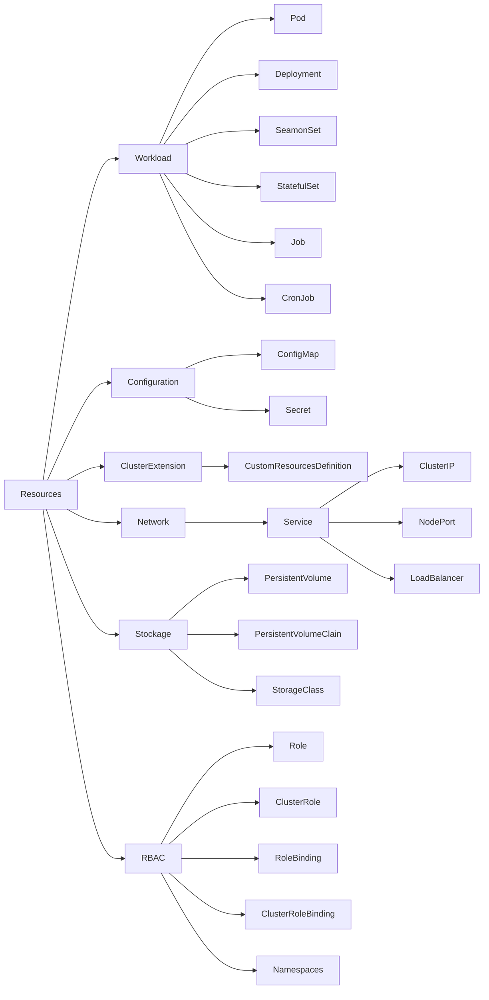

# Kubernetes | K8S | kube

> --From the Greek word pilot or helmsman.
> 
> Kubernetes is an open-source, extensible, portable platform that automates 
> software management, deployment, and scaling of containerized services and 
> workloads.

- Part of [Containerization](../README.md)
- https://youtu.be/10DBlZJntHc?t=752
- https://www.udemy.com/course/la_plateforme_k8s/learn/lecture/9922946?start=0#overview

## Table of content

1. [Concepts](#concepts)
1. [Cluster](#cluster)
1. [Managed](#managed)
1. [Objects](#objects)
   - [Pod](./pod.md)
   - [Service](service/service.md)
   - [Deployment](./deployment.md)
   - [Namespace](./namespace.md)
1. [Deployment](#deployment)
1. [Service](#service)
1. [Resources](#resources)
1. [Manage the cluster](#manage-the-cluster)
1. [Components](#components)
1. [Workshop](#workshop)
1. [Distributions](#distributions)


## Concepts

Containers
- It is an isolated processus (namespace & control groups)

Docker
- [Docker](../docker)
- Facilitates usage of containers
- Brings the concept of `image`:
  - package of an application and its dependencies (dependencies from Hell)
  - instantiate in a container
  - deployed on many environments
  - Lot of images on the Docker Hub: https://hub.docker.com

Microservices architecture
- Cut applications into many services (performance)
- Independent process with its own business responsibility
- Its own language
- Dedicated team per service
- A service can be updated alone
- Facilitate bug detection
- Extract the complexity of orchestration from the app 
- CONS: interfaces should be well-defined
- CONS: must have integration tests

Cloud Native
- Microservices oriented
- Packaged as containers
- Dynamically orchestrated
- CNCF.io | Cloud Native Computing Foundation (K8S, Prometheus, Fluentd...)

DevOps
- Reduce time between a feature is developed, and it is in production
- Continuous Deployment
- Automated Tests
- Automated Processes: provisioning (conf), IaC (infra), CI/CD, monitoring


- [Source Luc Juggery](https://www.udemy.com/course/la_plateforme_k8s/learn/lecture/9922952#overview)

Historic
- From Google's Borg system
- v1.0, July 2015
- Important project of the CNCF.io
  - https://www.cncf.io/projects/kubernetes/
  - https://www.cncf.io/projects/k3s/

Features
- Manage applications (deployment, scaling, self-healing)
- Reconciliation loops
- Stateless and stateful applications
- Secrets and configuration
- Long-running processes or batchs
- RBAC (Role-Based Access Control)

Infrastructure:
```
     ┌───────────────────────────────────────────────┐
     │ Cluster                                       │
     │                                               │
     │ ┌────────────────────────────────────┐        │
     │ │ Node                               │        │
     │ │                                    │        │
     │ │ ┌─────────────────────────┐        │        │
     │ │ │ Pod (network & storage) │        │        │
     │ │ │                         │        │        │
     │ │ │ ┌──────────────┐        │        │        │
     │ │ │ │ Container    │        │        │        │
     │ │ │ │              │        │        │        │
     │ │ │ └──────────────┘        │        │        │
     │ │ └─────────────────────────┘        │        │
     │ └────────────────────────────────────┘        │
     └───────────────────────────────────────────────┘
```


Application:
```
       ┌────────────────────────────────────┐ 
       │ Application                        │ 
       │                                    │ 
       │ ┌─────────────────────────┐        │ 
       │ │ Pod (Spec)              │        │
       │ │ = Business Service (MS) │        │ 
       │ │ ┌──────────────┐        │        │ 
       │ │ │ Replicas     │        │        │ 
       │ │ │              │        │        │ 
       │ │ └──────────────┘        │        │ 
       │ └─────────────────────────┘        │ 
       └────────────────────────────────────┘ 
```


## Cluster
- Set of nodes
- `master` or `worker`


## Managed

- [Managed clusters in production](./managed.md)


## Objects

- [Pod](./pod.md)
- [Service](service/service.md)


## Deployment
- Can be a service
- N identical pods
- Count of replicas


## Service
- Expose the applications from inside Pods to the interior or exterior of a cluster
- Mandatory to access an application from another Pod, even 
  if the other pod is inside the same cluster


## Resources



### Samples of configuration

```yaml
apiVersion: v1
kind: Pod
metadata:
  name: www
  labels:
    app: w3
spec:
  containers:
  - name: www
    image: nginx:1.16
```
- **Pod** configuration

```yaml
apiVersion: v1
kind: Service
metadata:
  name: www
spec:
  selector:
    app: w3
  ports:
  - port: 80
    targetPort: 80
```
- **Service** configuration

```yaml
apiVersion: apps/v1
kind: Deployment
metadata:
  name: www
spec:
  replicas: 3
  selector:
    matchLabels:
      app: w3
  template:
    metadata:
      labels:
        app: w3
    spec:
      containers:
      - name: www
        image: nginx:1.16
```
- **Deployment** configuration

### Labels and Annotations
- Information attached to the resources
- As key/value
- Labels: to select
- Annotations: used by external services


## Manage the cluster
- Send request to the API server
- Use the `kubectl` (use to talk with a cluster) binary or web interface
- Master nodes exposes API to manage the cluster (call by `kubectl`)
- Configuration set in one of the `.kube/config`


## Components

- Master / "control plane"
  - `apierver`: entrypoint
  - `scheduler`: select the node to deploy a pod
  - `controler-manager`: manage
  - `etcd`: key/value repository, very important (distributed database where the cluster state is stored)
- Worker
  - `kubelet`: ensure that pod's containers are ok, and re/start if needed 
  - `kube-proxy`: expose services to exterior
  - `container-runtime`

### API Server
- https://kubernetes.io/docs/reference/kubernetes-api/
- Via `kubectl` (use to talk with a cluster) or web interface
- Each request go through a pipeline: authentication, authorization, admission controller
- To create a node:
  1. => API Server
  1. => `etcd`
  1. => `scheduler`
  1. => `kubelet`
  1. => `docker`

### Context
- We often have several clusters
  - Local: minikube ou Docker Desktop
  - Staging
  - Production
- The context can be defined in
  - `.kube/config`
  - `$KUBECONFIG`
  - `--kubeconfig`
- https://github.com/ahmetb/kubectx
```shell
$ kubectl config view
$ kubectl config get-contexts
```

## Workshop
- Kubernetes is a cluster with some nodes... Get the list:
```shell
$ kubectl get nodes
```


## Distributions

### Installation
- https://gitlab.com/lucj/k8s-exercices/-/blob/master/Installation/kubectl.md `#INSTALL`
```shell
$ VERSION=$(curl -s https://storage.googleapis.com/kubernetes-release/release/stable.txt)
$ curl -LO https://storage.googleapis.com/kubernetes-release/release/$VERSION/bin/linux/amd64/kubectl
$ chmod +x ./kubectl
$ sudo mv ./kubectl /usr/local/bin/kubectl
```
- [Multipass](#multipass)

### Multipass
- [Multipass](../multipass)


### Minikube
- All the Kubernetes components on a **SINGLE LOCAL** virtual machine or in Docker: DO NOT USE IN PRODUCTION.
- Need a hypervisor as HyperKit or VirtualBox
- https://github.com/kubernetes/minikube  `#INSTALL`
- https://gitlab.com/lucj/k8s-exercices/-/blob/master/Installation/minikube.md
```shell
$ curl -Lo minikube https://storage.googleapis.com/minikube/releases/latest/minikube-darwin-amd64
$ chmod +x minikube
$ sudo mv minikube /usr/local/bin/

$ minikube start
$ kubectl get node
NAME       STATUS   ROLES           AGE   VERSION
minikube   Ready    control-plane   13s   v1.25.0
$ minikube start --driver docker --nodes 3
$ kubectl get no

$ minikube delete
```

### Kind (Kubernetes in Docker) `#INSTALL`
- Each node of the cluster run in a Docker container (easy to install)
- https://github.com/kubernetes-sigs/kind
- https://kind.sigs.k8s.io/docs/user/quick-start/
```shell
$ brew install kind
$ kind version

$ kind create cluster --name k8s
$ docker ps
$ kubectl config get-contexts
$ kubectl get nodes

$ kind create cluster --name k8s-2 --config config/config.kind.yaml
$ docker ps
$ kubectl config get-contexts
$ kubectl get nodes
$ kind get clusters

$ kind delete cluster --name k8s
$ kind delete cluster --name k8s-2
```

### MicroK8S
- Light, for development, CI/CD pipelines...
- https://microk8s.io/ `#INSTALL`
- https://gitlab.com/lucj/k8s-exercices/-/blob/master/Installation/microK8s.md
```shell
$ multipass launch --name microk8s --mem 4G
$ multipass exec microk8s -- sudo snap install microk8s --classic
$ multipass exec microk8s -- sudo microk8s.config > config/microk8s.yaml
$ export KUBECONFIG=$PWD/config/microk8s.yaml
$ kubectl get nodes
NAME       STATUS   ROLES    AGE     VERSION
microk8s   Ready    <none>   3m31s   v1.25.2

$ microk8s status  # TO GET ADD-ONS

$ multipass delete microk8s -p
```


### K3S
- Light Kubernetes distribution for IoT, for Edge Computing, on RasberryPi
- https://k3s.io/
- https://gitlab.com/lucj/k8s-exercices/-/blob/master/Installation/k3s.md
```shell
$ multipass launch --name k3s

$ IP=$(multipass info k3s-1 | grep IP | awk '{print $2}')
$ echo $IP
$ multipass exec k3s -- bash -c "curl -sfL https://get.k3s.io | sh -"
$ multipass exec k3s sudo cat /etc/rancher/k3s/k3s.yaml > config/k3s.cfg.tmp
$ cat config/k3s.cfg.tmp | sed "s/127.0.0.1/$IP/" > config/k3s.cfg
$ export KUBECONFIG=$PWD/config/k3s.cfg
$ kubectl get nodes
NAME   STATUS   ROLES                  AGE    VERSION
k3s    Ready    control-plane,master   4m6s   v1.24.6+k3s1

# Cluster multi-nodes
$ for node in k3s-2 k3s-3;do
  multipass launch -n $node
done
$ multipass ls
$ TOKEN=$(multipass exec k3s sudo cat /var/lib/rancher/k3s/server/node-token)
$ echo $TOKEN
$ multipass exec k3s-2 -- \
bash -c "curl -sfL https://get.k3s.io | K3S_URL=\"https://$IP:6443\" K3S_TOKEN=\"$TOKEN\" sh -"
$ multipass exec k3s-3 -- \
bash -c "curl -sfL https://get.k3s.io | K3S_URL=\"https://$IP:6443\" K3S_TOKEN=\"$TOKEN\" sh -"
$ kubectl get nodes
NAME    STATUS   ROLES                  AGE   VERSION
k3s     Ready    control-plane,master   13m   v1.24.6+k3s1
k3s-2   Ready    <none>                 77s   v1.24.6+k3s1
k3s-3   Ready    <none>                 39s   v1.24.6+k3s1
```

### K3D
- To deploy a K3S cluster with each node of the cluster running on a Docker container
- https://k3d.io/v5.4.6/
  - https://k3d.io/v5.4.6/#install-script
- https://gitlab.com/lucj/k8s-exercices/-/blob/master/Installation/k3d.md
```shell
### $ brew install k3d
$ curl -s https://raw.githubusercontent.com/rancher/k3d/main/install.sh | bash
$ k3d version
$ k3d cluster create --help
$ k3d cluster create k3s --agents 2
$ k3d cluster ls
NAME   SERVERS   AGENTS   LOADBALANCER
k3s    1/1       2/2      true
### $ kubectl config use-context k3d-k3s
$ kubectl get nodes
$ k3d cluster delete k3s
```
